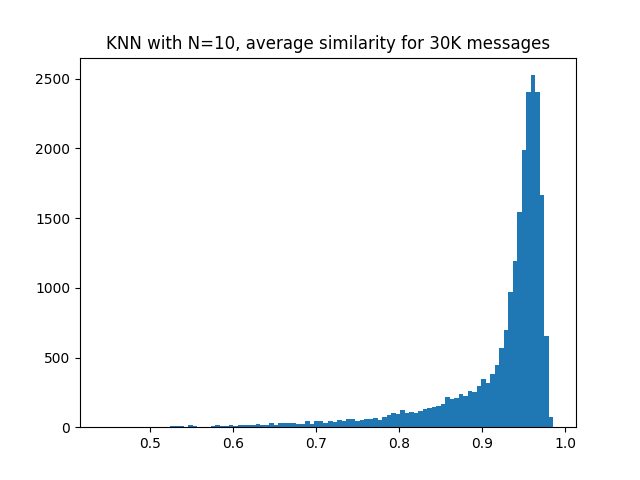

# Spack Monitor NLP


This is an effort to see if we can do some kind of clustering using the warning and error messages in
the server. The goal will be to:

1. retrieve current warnings and errors via the spack monitor API
2. build a word2vec model using them.
3. output embeddings for each
4. cluster!

⭐️ [View Interface](https://buildsi.github.io/spack-monitor-nlp/) ⭐️

You'll see that the best clustering comes from just using the error or warning messages,
and that most of the clusters are boost errors. Could it be that a direct match (e.g.,
parsing libraries in advance to identify text of errors and using that) is better?
Perhaps! And in fact we could do some kind of KNN based on that too. This is more
of an unsupervised clustering (we don't have labels). 

## Usage

```bash
$ python -m venv env
$ source env/bin/activate
$ pip install -r requirements.txt
```

Install umap from conda:

```bash
$ conda install -c conda-forge umap-learn
$ pip install umap-learn
```

Then download data from spack monitor

```bash
$ python 1.get_data.py
```

This will generate a file of errors and warnings!

```bash
$ tree data/
data/
├── errors.json
└── warnings.json
```

### Online ML

The script [2.online-ml.py](2.online-ml.py) will generate the clusters in [data/clusters](data/clusters).
Note that I've commented out the main function runs (since I've run them already) so if you want to re-produce
or run differently, either insert an interactive `IPython.embed()` or uncomment and edit areas.

```bash
python 2.online-ml.py
```

### Vectors and Docs Visuals

We next want to preprocess the data and generate models / vectors!

```bash
$ python 2.vectors.py
```

We are currently only parsing errors, as it's a smaller set and we are more interested
in build errors than warnings that clutter the signal. For the "error only" (or parsed) approach
we look for strings that have `error:` and split and take the right side of that. For all other
processing methods, we remove paths (e.g., tokenize then remove anything with an os.sep or path separator).

Then generate counts of data (to be put into [docs](docs) if we want to eventually visualize):

```bash
$ python 3.charts.py
Found 30000 errors!
1832 out of 30000 mention 'undefined reference'
```

Some data will be generated in data, and assets for the web interface will go
into [docs](docs). The interface allows you to select and see the difference between
the models, and clearly just using the error messages (parsed or not) has the strongest signal (best clustering).

And finally, generate a quick plot to show that, if we did KNN for each error, the mean similarity
of the closests 10 points (standard deviation not shown, but is calculated if we need):


 

## License

Spack is distributed under the terms of both the MIT license and the
Apache License (Version 2.0). Users may choose either license, at their
option.

All new contributions must be made under both the MIT and Apache-2.0
licenses.

See [LICENSE-MIT](https://github.com/spack/spack/blob/develop/LICENSE-MIT),
[LICENSE-APACHE](https://github.com/spack/spack/blob/develop/LICENSE-APACHE),
[COPYRIGHT](https://github.com/spack/spack/blob/develop/COPYRIGHT), and
[NOTICE](https://github.com/spack/spack/blob/develop/NOTICE) for details.

SPDX-License-Identifier: (Apache-2.0 OR MIT)

LLNL-CODE-811652
